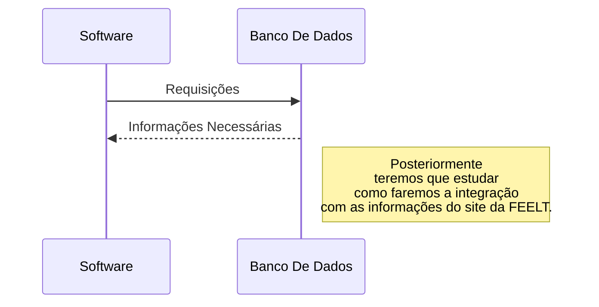

# Jus-Consultoria
O projeto visa desenvolver um software robusto e eficiente para o
gerenciamento de contratos. A solução proposta permitirá às
organizações **armazenar**, **acessar**, **modificar** e **excluir** contratos de forma segura e organizada. Além disso, será implementada uma tela de login
para garantir a autenticação dos usuários e o controle de acesso às
informações.

- Cadastro de novos usuários no sistema, bem como se comunicar com os dados preenchidos no formulário presente no site que será elaborado pela FEELT.
- Possibilidade de alterar dados do usuário.
- **Diferença de níveis de acesso às informações do site**. Haverá um usuário administrador, capaz de cadastrar novos contratos e pareceres jurídicos. 
- Cadastro/modificação e exclusão de novos contratos e pareceres jurídicos no sistema.
- Envio do contrato ou parecer jurídico para assinatura por meio de link externo
- Armazenar os contratos assinados em um banco de dados respeitando a LGPD. 
- 
## Arquitetura da Solução

## Informações importantes sobre os tipos do projeto

 - A JUS Consultoria presta 3 tipos de serviços principais, dessa forma cada contrato poderá ser de um dos 3 tipos:
	 - Consultoria Empresarial
	 - Consultoria Tributária
	 - Câmara de Arbitragem

## Estrutura inicial do projeto JUS-Consultoria

 -   **documentacao**:
	 -  README.md (descrição do projeto, instruções de instalação, etc.)
      - LICENÇA.txt (licença do software)
    

-   **imagens**: (logotipos, ícones, etc.)
    
-   **lib**: (bibliotecas úteis, exemplo Spacy, Pandas)
    
-   **src**:
  
	-   **contratos**:
		-   controladores.py (lógica de negócio para gerenciamento de contratos)
		-   modelos.py (modelos de dados para contratos)
		-   visualizacoes.py (interface gráfica para contratos)
    
	-   **usuario**:
		-   controladores.py (lógica de negócio para gerenciamento de usuários)    
		-   modelos.py (modelos de dados para usuários)  
		-   visualizacoes.py (interface gráfica para usuários)
    
	-   **empresa**:
		-   controladores.py (lógica de negócio para gerenciamento de empresa)  
		-   modelos.py (modelos de dados para empresa)   
		-   visualizacoes.py (interface gráfica para empresa)
    
	-   **interface**:
		-   janela_principal.py (interface principal da aplicação)
		-   outras_janelas.py (interfaces para outras funcionalidades)
	
	-   **utilitarios**:
		-   funcoes_auxiliares.py (funções úteis para o projeto)
		-   configuracoes.py (configurações gerais da aplicação)
    
-   **testes**:
-   testes_unitario.py (testes unitários para o código)
    

### Explicação da Estrutura Proposta:

 -   **raiz_projeto**: Pasta principal do projeto.
    
 -   **documentacao**: Contém os documentos relevantes do projeto, como o README, manual do usuário e a licença.
    
 -   **imagens**: imagens, logotipos e outros recursos visuais.
    
 -   **lib**: Bibliotecas de terceiros que não fazem parte da biblioteca padrão do Python.
 
 -    **src**: Pasta principal do código-fonte, dividida em subpastas:

 	  -    **contratos**, **empresa**, **usuário**: Contém o código relacionado à funcionalidade de gerenciamento de contratos.
    
 			-   **controladores**.py: Lógica de negócio para operações com contratos (criar, editar, excluir, pesquisar, etc.).
			-   **modelos**.py: Definição dos modelos de dados para representar contratos no banco de dados.
			-   **visualizacoes**.py: Interface gráfica para interação com os contratos (telas, widgets, etc.).

	  -   **interface**: Contém o código da interface principal da aplicação e outras interfaces.
     
	 		-   janela_principal.py: Interface principal da aplicação, ponto de partida para o usuário.
			-   outras_janelas.py: Interfaces para outras funcionalidades da aplicação (telas de login, configurações, etc.).

	  -   **utilitarios**: Armazena funções auxiliares e configurações gerais da aplicação.
     
			-   funcoes_auxiliares.py: Funções úteis para diversas partes do projeto.
			-   configuracoes.py: Definição de configurações gerais da aplicação (caminhos de arquivos, configurações de logging, banco de dados etc.)

 -   **testes**: Contém testes unitários para verificar o funcionamento do código.

	 - testes_unitario.py: Testes unitários para as diferentes partes do código.

### Links para nossa organização

 - Trello: https://trello.com/b/cJ3QsjEh/gestao-de-projetos-bugware
 - Discord: https://discord.gg/g4U6AY4g

### Tkinter
Tkinter ou Tk Interface é um dos pacotes Python mais populares e também a forma padrão de criar GUIs de desktop em Python.

Tkinter é a combinação de Tk; Um kit de ferramentas de código aberto para criar widgets de elementos como botões, menus, telas, textos e assim por diante. mais código Python que permite controlar essas interfaces.

Embora o tkinter permita apenas a criação de interfaces básicas, seus widgets podem ser difíceis de depurar.

Também não possui nenhum tipo de software para projetar interfaces gráficas visualmente, e embora exista um projeto chamado Tkinter Designer que converte designs feitos em Figma para código Tkinter, mesmo assim não é tão fácil customizar projetos grandes.

https://github.com/ParthJadhav/Tkinter-Designer
 
 
### Padrão de projeto MVC

O padrão de projeto Model-View-Controller (MVC) é um padrão arquitetural, isto é, significa que ele diz como será a arquitetura do sistema. Ele também é uma especialização do Padrão Arquitetural em Camada.  
Esse padrão de projeto foco em três partes, são elas:

-   Model: que contém as classes de domínio do problema da sua aplicação. Também é na Camada Model que há as regras de negócio da sua aplicação.
    
-   Controller: é quem faz o intermédio entre o Model e a View, ou seja, define como será o comportamento da View dado as entradas do usuário.
    
-   View: é como será apresentado o sistema ao usuário final, contendo suas entradas e saídas.   

Segue um projeto escolhido para exemplificar o MVC em um projeto Python:
[https://github.com/MarcosDias/PythonMVC]
