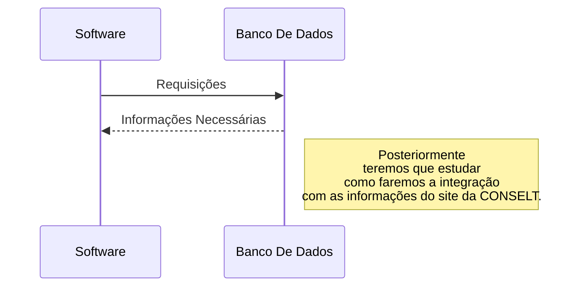

# Jus-Consultoria
O projeto visa desenvolver um software robusto e eficiente para o
gerenciamento de contratos. A solução proposta permitirá às
organizações **armazenar**, **acessar**, **modificar** e **excluir** contratos de forma segura e organizada. Além disso, será implementada uma tela de login
para garantir a autenticação dos usuários e o controle de acesso às
informações.

- Cadastro de novos usuários no sistema, bem como se comunicar com os dados preenchidos no formulário presente no site que será elaborado pela CONSELT.
- Possibilidade de alterar dados do usuário.
- **Diferença de níveis de acesso às informações do site**. Haverá um usuário administrador, capaz de cadastrar novos contratos e pareceres jurídicos.
- Cadastro/modificação e exclusão de novos contratos e pareceres jurídicos no sistema.
- Envio do contrato ou parecer jurídico para assinatura por meio de link externo
- Armazenar os contratos assinados em um banco de dados respeitando a LGPD.
## Arquitetura da Solução



## Informações importantes sobre os tipos do projeto

 - A JUS Consultoria presta 3 tipos de serviços principais, dessa forma cada contrato poderá ser de um dos 3 tipos:
	 - Consultoria Empresarial
	 - Consultoria Tributária
	 - Câmara de Arbitragem

## Links para nossa organização

 - Trello: https://trello.com/b/cJ3QsjEh/gestao-de-projetos-bugware
 - Discord: https://discord.gg/g4U6AY4g


## Tkinter
Tkinter ou Tk Interface é um dos pacotes Python mais populares e também a forma padrão de criar GUIs de desktop em Python.

Tkinter é a combinação de Tk; Um kit de ferramentas de código aberto para criar widgets de elementos como botões, menus, telas, textos e assim por diante. mais código Python que permite controlar essas interfaces.

Embora o tkinter permita apenas a criação de interfaces básicas, seus widgets podem ser difíceis de depurar.

Também não possui nenhum tipo de software para projetar interfaces gráficas visualmente, e embora exista um projeto chamado Tkinter Designer que converte designs feitos em Figma para código Tkinter, mesmo assim não é tão fácil customizar projetos grandes.

https://github.com/ParthJadhav/Tkinter-Designer


## Padrão de projeto MVC

O padrão de projeto Model-View-Controller (MVC) é um padrão arquitetural, isto é, significa que ele diz como será a arquitetura do sistema. Ele também é uma especialização do Padrão Arquitetural em Camada.
Esse padrão de projeto foco em três partes, são elas:

-   Model: que contém as classes de domínio do problema da sua aplicação. Também é na Camada Model que há as regras de negócio da sua aplicação.

-   Controller: é quem faz o intermédio entre o Model e a View, ou seja, define como será o comportamento da View dado as entradas do usuário.

-   View: é como será apresentado o sistema ao usuário final, contendo suas entradas e saídas.

Segue um projeto escolhido para exemplificar o MVC em um projeto Python:
[https://github.com/MarcosDias/PythonMVC]

## Guia Básico de Git para o nosso projeto
O Git Workflow é uma metodologia que define como as equipes colaboram e gerenciam o código fonte usando o Git, um sistema de controle de versão distribuído. Existem várias abordagens de workflow no Git, mas uma das mais comuns é o GitFlow. Aqui está um resumo desse modelo:

-	**Branches Principais**:
	-	**Main**: Representa a versão de produção do código. Somente o código estável e testado deve ser fundido (merged) nesta branch.
	-	**Develop**: É a branch de desenvolvimento principal. As novas funcionalidades são desenvolvidas e testadas aqui antes de serem incorporadas na branch main.

-	**Branches de Suporte**:
	-	**Feature branches**: Cada nova funcionalidade é desenvolvida em sua própria branch de feature, criada a partir da branch develop. Quando a funcionalidade estiver completa, ela é fundida de volta na branch develop.
	-	**Release branches**: Quando está pronto para lançar uma nova versão, uma branch de release é criada a partir da branch develop. Nesta branch, os últimos ajustes finais podem ser feitos antes de serem mesclados na branch main e develop.
	-	**Hotfix branches**: Se surgir um problema crítico na produção, uma branch de hotfix é criada a partir da branch main. Isso permite que correções sejam feitas rapidamente e mescladas tanto na branch main quanto na develop.

-	**Fluxo de Trabalho**:
	-	Desenvolvedores criam branches para trabalhar em novas funcionalidades ou correções.
	-	As alterações são regularmente mescladas de volta para a branch develop para integração contínua.
	-	Quando uma versão estável está pronta, uma branch de release é criada para finalizar a versão.
	-	Após testes e revisões, a branch de release é mesclada tanto na branch main quanto na develop.
	-	Problemas críticos na produção são corrigidos em branches de hotfix e mesclados rapidamente na main e na develop.


### Comandos necessários para clonar o repositório e começar a codar!

-	Clonando o Repositório:Para clonar um repositório específico do Git, você pode usar o comando git clone seguido da URL do repositório. Por exemplo:
```
git clone https://github.com/asciiej/JUS-Consultoria-Front-End.git
```

-	Adicionando o github do repositório como fonte do repositório na sua máquina:
```
git remote add origin https://github.com/asciiej/JUS-Consultoria-Front-End.git
```
Ao final dessa etapa você provavelmente será perguntado para logar na sua conta do github

-	Navegando para a Branch Develop:Após clonar o repositório, é importante mudar para a branch develop. Você pode fazer isso usando o comando git checkout:
```
git checkout develop
```
Isso garante que você esteja trabalhando na branch de desenvolvimento correta.
-	Fazendo Alterações no Código:Agora que você está na branch develop, faça as alterações necessárias no código usando o editor de texto ou a IDE de sua escolha.
-	Adicionando as Alterações:Depois de fazer suas alterações, você precisa adicioná-las ao índice do Git para prepará-las para o commit. Use o comando git add seguido dos arquivos que foram modificados. Por exemplo, para adicionar todos os arquivos alterados, você pode usar:
```
git add .
```
-	Commitando as Alterações:Agora que as alterações estão no índice, você pode commitá-las. Use o comando git commit seguido de uma mensagem de commit que descreva sucintamente as alterações que você fez:
```
git commit -m "Mensagem do commit"
```
Substitua "Mensagem do commit" pela sua mensagem de commit.
-	Enviando as Alterações para o Repositório Remoto:Finalmente, para enviar suas alterações para o repositório remoto, você pode usar o comando git push. Como você está trabalhando na branch develop, você precisará especificar isso ao fazer o push:

```
git push origin develop
```
Isso enviará suas alterações para a branch develop do repositório remoto.


### E se for necessário criarmos uma branch a partir da branch de develop para trabalharmos numa feature?

-	Certifique-se de estar na branch Develop:Antes de criar uma nova branch de feature, é importante garantir que você está na branch develop. Você pode verificar isso usando o comando:
```
git checkout develop
```

-	Atualize a branch Develop:Para garantir que você está trabalhando com a versão mais recente do código, é uma boa prática atualizar sua branch develop antes de criar uma nova branch de feature. Você pode fazer isso usando os comandos:
```
git pull origin develop
```
Isso garante que você tenha as últimas alterações da branch develop.

-	Crie uma Nova Branch de Feature:Agora, você pode criar uma nova branch de feature. Vamos supor que você está criando uma feature para adicionar uma funcionalidade de login. Você pode criar a branch de feature usando o comando:
```
git checkout -b feature/login
```
Neste exemplo, feature/login é o nome da sua nova branch de feature. Você pode substituir "login" pelo nome da sua funcionalidade específica.

-	Desenvolva a Nova Funcionalidade:Agora que você está na sua nova branch de feature, você pode começar a trabalhar na implementação da funcionalidade. Faça as alterações necessárias nos arquivos do projeto.
-	Adicione e Comite as Alterações:Após implementar a funcionalidade, adicione e comite suas alterações usando os comandos:
```
git add .
git commit -m "Adiciona funcionalidade de login"
```
Substitua "Adiciona funcionalidade de login" pela sua mensagem de commit descritiva.

-	Envie a Nova Branch para o Repositório Remoto:Finalmente, você pode enviar sua nova branch de feature para o repositório remoto para colaboração ou revisão. Use o comando:
```
git push origin feature/login
```
Isso enviará a nova branch feature/login para o repositório remoto.

Agora você criou com sucesso uma nova branch de feature a partir da branch develop e implementou uma nova funcionalidade. Essa nova branch está pronta para colaboração ou revisão.


